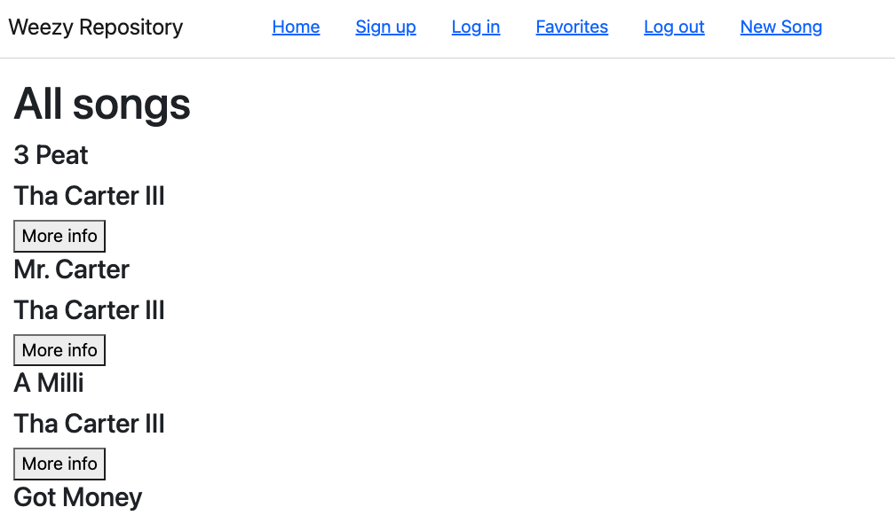

# Weezy Repository

The Weezy Repository indexes Lil Wayne songs and provides convenient links for listening in order to lessen the burden on the Wayne fans and Wayne novices to track down his work. I decided to build this project when I was confronted with how few people knew about his mixtape.

This is the frontend of the project, built with React.js.

# Installation

Clone down the repository. Navigate to the project directory and run the following commands:

```bash
npm install
```

## Usage

In the repository, run the following commands:

```bash
npm run dev
```

You'll need to have the backend code (https://github.com/leautierfr/wayne-app-backend) running on http://localhost:3000.
You can view the app on http://localhost:5173



### Roadmap

Fix the unfavorite button.
Improve aesthetics with bootstrap.
Display favorite song names.
Display favorites based on authenticated user.
Find an api to facilitate the process to add music.
